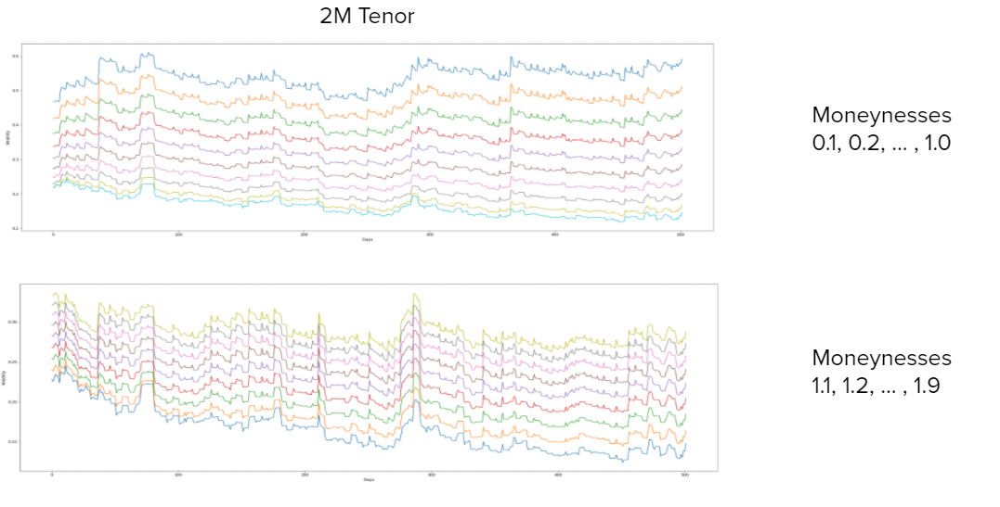
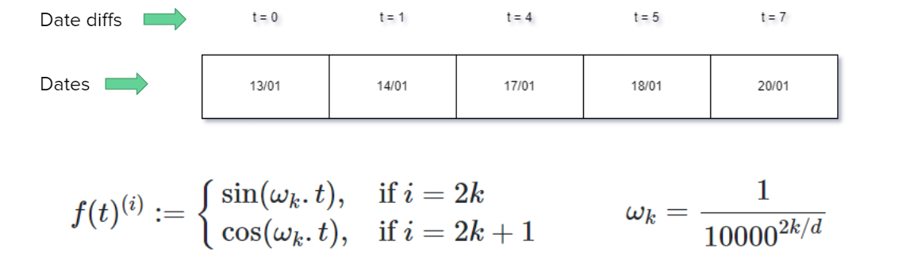
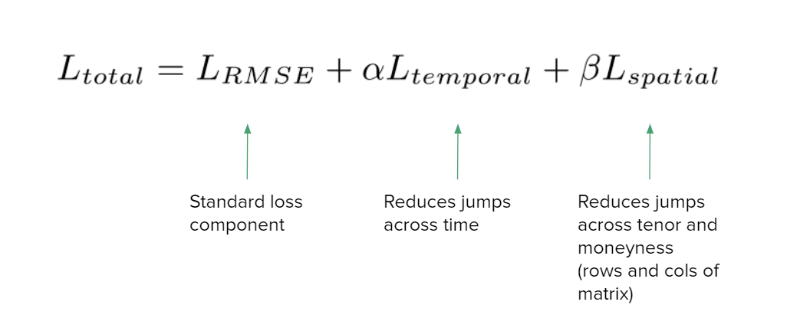
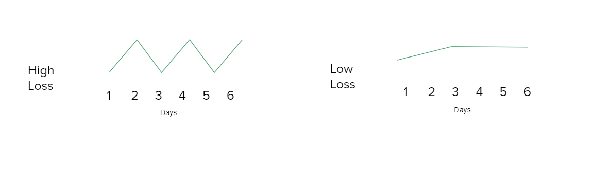
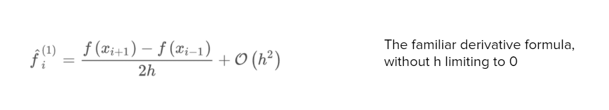
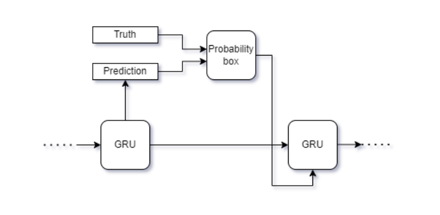
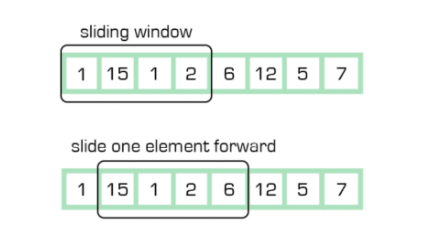
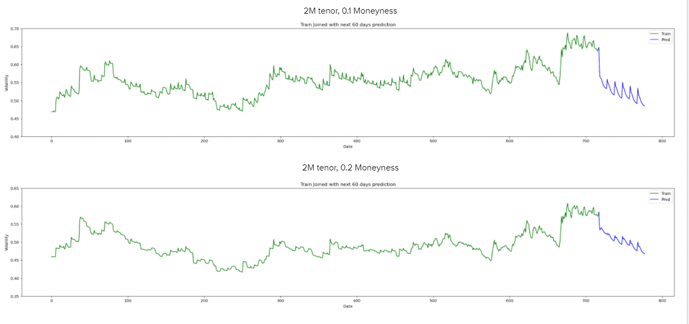

# Wells-QuantAI
## Runners-Up out of 586 Participating teams
### Team Third Degree Burn's Solution to the [Wells Fargo Quant AI Hack](https://dare2compete.com/hackathon/wells-fargo-quantitative-ai-hackathon-shaastra-2022-indian-institute-of-technology-iit-madras-248431)

## Solution Outline

### Dataset Exploration
- The data is clean, there are no NaN values and no datatype conflicts
- Every weekend in the dataset has been skipped and there are no other holidays
- The Volatility values lie between between 0 and 1
- We also noticed some patterns noticed between moneynesses for a particular tenor

### Correlation Between Different Moneyness

As you can see from the image below we observe that there is a correlation between the volatility values for different moneyness values. One kind of trend is followed for all Moneyness values less than 1 and a different one is followed for all moneyness values greater than 1.

### Model Architecture
#### Encoder: 
- Multiple blocks of multi-headed self attention and a layer normalisation with residual connections. 
- Input: Flattened IV values with the positional embeddings (will be explained later)
#### Decoder: 
- GRU layer: predicts some time steps into the future. 
- Input: Previous output of the GRU and a context vector (weighted average of encoder outputs). 
- Weights calculated conditional on current hidden state of the GRU and the encoder outputs. This setup allows us to have a large input sequence sizes.

Below shown is an image of what the architecture looks like:

  

### Creating Positional Embeddings for the Dates
- Positional embedding of an element is proportional to difference between its date and the date of the first element in the input sequence. 
- This Accounts for any turbulence on weekends and other market-closed days leading to abrupt changes in price.

### Our Loss Function
The Loss function is a combination of RMSE, temporal continuity and spatial loss. (All of which we explain subsequently).

### Temporal Continuity
This minimises the difference in IV values as time evolves to prevent any erratic predictions. For this, the L1 loss between consecutive predictions were minimised.

### Spatial Loss
We Introduce a spatial loss so that the final IV surface was free of any unexpected spikes. For this, the gradient of the predicted IV surface is computed and minimised.

### Teacher Forcing
To stabilise the training, teacher forcing was introduced. In the decoder, randomly the ground truth values of the current time step were used as an input for the next time step instead of the predicted values.  If not enforced, a single bad prediction could cascade to bigger failures leading to highly unstable training.

### Prediction Method - Rolling Window
The input to the model is a window of size W and the GRU predicts the next K days. K<W is maintained so that the weights of the context vector has enough information to have a reasonable distribution over the input window.

The input window is then translated by K steps and this forms the new input. The same process repeats. The missing days in the prediction template is accounted for in the positional embedding scheme explained previously.

                                                                                       
### Results - Predictions
These are some of the graphs that we plotted as the results from our model.

                       
### Model Selection and Tuning
#### Models we tried –
- ARIMA – bad training losses
- Vanilla LSTM
- LSTM + Attention – Our 2nd best – 0.0199
- Self attention Enc + GRU Dec – Our best – 0.01947
- Applying Moving Averages – Did not give fine-grained patterns, increasing loss

#### Hyperparams optimized –
- Batch size – 64 (best), 128 
- Window lengths – input 50 days, output 10 days
- Enc/Dec no. of hidden dims, layers
- Teacher Forcing ratio
- Custom Loss weights

### Time, Memory and Unique Features
- Training Time – 15 mins total on Google Colab GPU
- Memory Usage – 50 MB for state dictionary
- Our model is unique – supports any input window size for the same number of parameters
- Can predict any number of days into the future, tunable parameter
- Deep learning – can generate non-linear decision boundaries, hence adapt to more complicated patterns
                                                                                       
